<p align="center">
<a href="https://meoki.net">
    
</a>
</p>

## Hi, I'm Sáng 👋🏾
A wibu come from **Vietnam** 😀. I'm currently studying **CyberSecurity/Information Security** at UIT - Vietnam National University Ho Chi Minh City. I have a strong passion for Japanese culture (noo, not what you're thinking ~~jAv~~), I mean **Anime** 😀. Weeboo never dieee ! And, welcome to my world!

For an overview about me and my some project, you can see at [**my portfolio**](https://meoki.net). And for some writing articles that I made or shared, let's take a look at [**my blog**](https://meoki.net/blog). And if you want to see some other things about me, I have some profile platforms below, check it out!

Thanks for your attention ❤
### Languages
<p>
    
    
    
    
    
    
    
    
    
</p>

### Tools & Frameworks
<p>
    
    
    
    
    
    
    
    
</p>


### Find me around the web 🌎
<a href="https://facebook.com/slytherinnn/"> </a>
- Information in public on <a href="https://meoki.net/">__Portfolio__</a> ✍🏾
- Sharing updates on <a href="https://facebook.com/slytherinnn/">__Facebook__</a> 💼
- Other products on <a href="https://www.behance.net/meokisama">__Behance__</a> 🏓
- Daily photos on <a href="https://www.instagram.com/hi.im.meoki/">__Instagram__</a> 📷
- "Wibu" collection on <a href="https://www.flickr.com/photos/meokisama/albums">__Flickr__</a> 👾

<br>

##

### We can't work without music (it's me, actually)

##
### And a little Japanese culture
[](https://anilist.co/user/meokisama/)

##
___NOTE:___ _Top languages shown below does not indicate my skill level or something like that, like its title - "Most Used Languages", it's just a github metric of which languages I have the most code on Github._


<a href="https://github.com/meokisama">
  
</a>
<a href="https://github.com/meokisama">
  
</a>

<!--<div style="overflow: hidden;justify-content:space-around;">
  
  
</div> -->

<div style="overflow: hidden;justify-content:space-around;">
  
  
</div>

##
#### The sadness...

<!--START_SECTION:waka-->


**🐱 My GitHub Data** 

> 🏆 1,808 Contributions in the Year 2021
 > 
> 📦 5.5 MB Used in GitHub's Storage 
 > 
> 🚫 Not Opted to Hire
 > 
> 📜 52 Public Repositories 
 > 
> 🔑 9 Private Repositories  
 > 
**I'm an Early 🐤** 

```text
🌞 Morning    105 commits    ███░░░░░░░░░░░░░░░░░░░░░░   13.55% 
🌆 Daytime    442 commits    ██████████████░░░░░░░░░░░   57.03% 
🌃 Evening    194 commits    ██████░░░░░░░░░░░░░░░░░░░   25.03% 
🌙 Night      34 commits     █░░░░░░░░░░░░░░░░░░░░░░░░   4.39%

```
📅 **I'm Most Productive on Saturday** 

```text
Monday       75 commits     ██░░░░░░░░░░░░░░░░░░░░░░░   9.68% 
Tuesday      130 commits    ████░░░░░░░░░░░░░░░░░░░░░   16.77% 
Wednesday    116 commits    ███░░░░░░░░░░░░░░░░░░░░░░   14.97% 
Thursday     137 commits    ████░░░░░░░░░░░░░░░░░░░░░   17.68% 
Friday       68 commits     ██░░░░░░░░░░░░░░░░░░░░░░░   8.77% 
Saturday     162 commits    █████░░░░░░░░░░░░░░░░░░░░   20.9% 
Sunday       87 commits     ██░░░░░░░░░░░░░░░░░░░░░░░   11.23%

```


📊 **This Week I Spent My Time On** 

```text
⌚︎ Time Zone: Asia/Ho_Chi_Minh

💬 Programming Languages: 
No Activity Tracked This Week

🔥 Editors: 
No Activity Tracked This Week

💻 Operating System: 
No Activity Tracked This Week

```


 Last Updated on 24/10/2021
<!--END_SECTION:waka-->
### Summary

