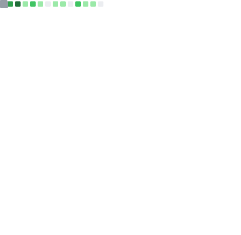
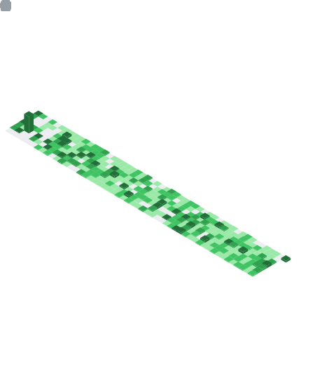

<p align="center">
<a href="https://meoki.vn">
    
</a>
</p>

<h2> Greetings!   </h2>

Hello there! I'm **Meoki**, a technology enthusiast who enjoys building useful things, exploring new ideas, and continuously learning. Beyond, i'm a big fan of Japanese culture. I enjoy learning Japanese, exploring its traditions and culture, and yes, i’m proudly an otaku who loves anime, manga, and games.

Feel free to explore my projects and thanks for stopping by! ❤

### Languages
<p>
    
    
    
    
    
    
    
    
    
</p>

### Tools & Frameworks
<p>
    
    
    
    
    
    
    
</p>


### Find me around the web 🌎
<a href="https://facebook.com/slytherinnn/"> </a>
- Information in public on <a href="https://meoki.vn/">__Portfolio__</a> ✍🏾
- Sharing updates on <a href="https://facebook.com/slytherinnn/">__Facebook__</a> 💼
- Other products on <a href="https://www.behance.net/meokisama">__Behance__</a> 🏓
- Daily photos on <a href="https://www.instagram.com/meokisama/">__Instagram__</a> 📷
- "Wibu" collection on <a href="https://www.flickr.com/photos/meokisama/albums">__Flickr__</a> 👾

<br>

##

### Japanese Culture & Light Novels 🇯🇵

Outside of programming, I'm a passionate light novel reader and a fan of Japanese culture. Over the years, I've built several projects to contribute to the Vietnamese light novel community:

* 📚 [**Ranobe.vn**](https://ranobe.vn/) — My personal blog about light novels.
* 🌸 [**Ranobe Hub**](https://hub.ranobe.vn/) — A platform for sharing light novels.
* 📖 [**Aozora**](https://github.com/meokisama/aozora) — A desktop EPUB reader for an enjoyable Japanese reading experience.
* 🏆 [**Vietnamese Light Novel Ranking**](https://bxh.lightnovel.vn/) — A community ranking website for light novels.

Building these projects is my way of combining my passion for software development with my love for Japanese culture.


<p>
    <a href="https://ranobe.vn/"> </a>
    <a href="https://hub.ranobe.vn/"> </a>
</p>
<p>
    
    
</p>


<!--[](https://anilist.co/user/meokisama/)-->

##
___NOTE:___ _The languages listed below do not necessarily reflect my proficiency level, as the title suggests - "Most Used Languages". Rather, they represent the languages in which I have contributed the most code on Github, serving as a metric of my activity on Github._

<p align="center">
    <a href="https://github.com/meokisama">
        
    </a>
    <a href="https://github.com/meokisama">
        
    </a>
</p>
    
<!--<div style="overflow: hidden;justify-content:space-around;">
  
  
</div> -->

<div align="center" style="overflow: hidden;justify-content:space-around;">
  
  
</div>

##

<!--START_SECTION:waka-->
**I'm a Night 🦉** 

```text
🌞 Morning                1464 commits        ███░░░░░░░░░░░░░░░░░░░░░░   13.03 % 
🌆 Daytime                3348 commits        ███████░░░░░░░░░░░░░░░░░░   29.80 % 
🌃 Evening                1739 commits        ████░░░░░░░░░░░░░░░░░░░░░   15.48 % 
🌙 Night                  4683 commits        ██████████░░░░░░░░░░░░░░░   41.69 % 
```
📅 **I'm Most Productive on Tuesday** 

```text
Monday                   2997 commits        ███████░░░░░░░░░░░░░░░░░░   26.68 % 
Tuesday                  3090 commits        ███████░░░░░░░░░░░░░░░░░░   27.51 % 
Wednesday                643 commits         █░░░░░░░░░░░░░░░░░░░░░░░░   05.72 % 
Thursday                 1327 commits        ███░░░░░░░░░░░░░░░░░░░░░░   11.81 % 
Friday                   459 commits         █░░░░░░░░░░░░░░░░░░░░░░░░   04.09 % 
Saturday                 1038 commits        ██░░░░░░░░░░░░░░░░░░░░░░░   09.24 % 
Sunday                   1680 commits        ████░░░░░░░░░░░░░░░░░░░░░   14.95 % 
```


📊 **This Week I Spent My Time On** 

```text
🕑︎ Time Zone: Asia/Ho_Chi_Minh

💬 Programming Languages: 
JavaScript               20 hrs 42 mins      █████████████░░░░░░░░░░░░   51.50 % 
TypeScript               7 hrs 31 mins       █████░░░░░░░░░░░░░░░░░░░░   18.73 % 
Markdown                 5 hrs 36 mins       ███░░░░░░░░░░░░░░░░░░░░░░   13.94 % 
JSON                     2 hrs 3 mins        █░░░░░░░░░░░░░░░░░░░░░░░░   05.11 % 
Python                   57 mins             █░░░░░░░░░░░░░░░░░░░░░░░░   02.38 % 

🔥 Editors: 
Claude Code              25 hrs 21 mins      ████████████████░░░░░░░░░   63.07 % 
VS Code                  14 hrs 50 mins      █████████░░░░░░░░░░░░░░░░   36.93 % 

💻 Operating System: 
Windows                  40 hrs 11 mins      █████████████████████████   100.00 % 
```


 Last Updated on 27/06/2026 04:03:17 UTC
<!--END_SECTION:waka-->
### Summary


*That's all, thanks and have a nice day!*

<p align="center">
    
</p
