<p align="center">
<a href="https://meoki.net">
    
</a>
</p>

<h2> Hi, you can call me Meoki   </h2>

A wibu come from **Vietnam** 😀. I'm currently studying **CyberSecurity/Information Security** at UIT - Vietnam National University Ho Chi Minh City. I have a strong passion for Japanese culture, I mean **Anime** 😀. Weeboo never dieee ! And, welcome to my world!

For an overview about me and my some project, you can see at [**my portfolio**](https://meoki.net). And for some writing articles that I made or shared, let's take a look at [**my blog**](https://meoki.net/blog). And if you want to see some other things about me, I have some profile platforms below, check it out!

Thanks for your attention ❤
### Languages
<p>
    
    
    
    
    
    
    
    
    
</p>

### Tools & Frameworks
<p>
    
    
    
    
    
    
    
    
</p>


### Find me around the web 🌎
<a href="https://facebook.com/slytherinnn/"> </a>
- Information in public on <a href="https://meoki.net/">__Portfolio__</a> ✍🏾
- Sharing updates on <a href="https://facebook.com/slytherinnn/">__Facebook__</a> 💼
- Other products on <a href="https://www.behance.net/meokisama">__Behance__</a> 🏓
- Daily photos on <a href="https://www.instagram.com/hi.im.meoki/">__Instagram__</a> 📷
- "Wibu" collection on <a href="https://www.flickr.com/photos/meokisama/albums">__Flickr__</a> 👾

<br>

##

### And a little Japanese culture
*Hiii, about this 2D industry, we have a static anime-manga-lightnovel blog - [**A Lonely Comet**](https://alonelycomet.meoki.net/), empire of dreamers, we write everything about anime-manga-light novel.*

***[Vietnamese]** Xin chào, đối với những ai có hứng thú, chúng ta cũng có một blog [**A Lonely Comet**](https://alonelycomet.meoki.net/) siêu xịn đây, thiên đường danh cho anh em wibu... Kèm theo đó là một server Discord bên dưới 😉*
<p>
    <a href="https://alonelycomet.meoki.net/"> </a>
    <a href="https://discord.gg/hNpaMKMtN8"> </a>
</p>
<p>
    
    
</p>


<!--[](https://anilist.co/user/meokisama/)-->

##
___NOTE:___ _Top languages shown below does not indicate my skill level or something like that, like its title - "Most Used Languages", it's just a github metric of which languages I have the most code on Github._

<p align="center">
    <a href="https://github.com/meokisama">
        
    </a>
    <a href="https://github.com/meokisama">
        
    </a>
</p>
    
<!--<div style="overflow: hidden;justify-content:space-around;">
  
  
</div> -->

<div align="center" style="overflow: hidden;justify-content:space-around;">
  
  
</div>

##

<!--START_SECTION:waka-->
**I'm an Early 🐤** 

```text
🌞 Morning    102 commits    █████░░░░░░░░░░░░░░░░░░░░   21.21% 
🌆 Daytime    232 commits    ████████████░░░░░░░░░░░░░   48.23% 
🌃 Evening    132 commits    ██████░░░░░░░░░░░░░░░░░░░   27.44% 
🌙 Night      15 commits     ░░░░░░░░░░░░░░░░░░░░░░░░░   3.12%

```
📅 **I'm Most Productive on Saturday** 

```text
Monday       43 commits     ██░░░░░░░░░░░░░░░░░░░░░░░   8.94% 
Tuesday      42 commits     ██░░░░░░░░░░░░░░░░░░░░░░░   8.73% 
Wednesday    30 commits     █░░░░░░░░░░░░░░░░░░░░░░░░   6.24% 
Thursday     66 commits     ███░░░░░░░░░░░░░░░░░░░░░░   13.72% 
Friday       90 commits     ████░░░░░░░░░░░░░░░░░░░░░   18.71% 
Saturday     157 commits    ████████░░░░░░░░░░░░░░░░░   32.64% 
Sunday       53 commits     ██░░░░░░░░░░░░░░░░░░░░░░░   11.02%

```


📊 **This Week I Spent My Time On** 

```text
⌚︎ Time Zone: Asia/Ho_Chi_Minh

💬 Programming Languages: 
No Activity Tracked This Week

🔥 Editors: 
No Activity Tracked This Week

💻 Operating System: 
No Activity Tracked This Week

```


 Last Updated on 01/05/2022 16:22:01 UTC
<!--END_SECTION:waka-->
### Summary


*That's all, thanks and have a nice day!*

<p align="center">
    
</p
