<p align="center">
<a href="https://meoki.vn">
    
</a>
</p>

<h2> Greetings!   </h2>

Hello there! I'm **Meoki**, a passionate individual with a curiosity-driven mindset. I find joy in exploring the wonders of the world and engaging in meaningful conversations with people from diverse backgrounds.

For an overview about me and my some projects, I have [**my portfolio**](https://meoki.vn) and [**my blog**](https://meoki.vn/blog), aiming to inspire and connect with fellow enthusiasts. For some other things, I have social platform profiles below, join me on this journey of creativity and discovery!

Thanks ❤
### Languages
<p>
    
    
    
    
    
    
    
    
    
</p>

### Tools & Frameworks
<p>
    
    
    
    
    
    
    
    
</p>


### Find me around the web 🌎
<a href="https://facebook.com/slytherinnn/"> </a>
- Information in public on <a href="https://meoki.vn/">__Portfolio__</a> ✍🏾
- Sharing updates on <a href="https://facebook.com/slytherinnn/">__Facebook__</a> 💼
- Other products on <a href="https://www.behance.net/meokisama">__Behance__</a> 🏓
- Daily photos on <a href="https://www.instagram.com/hi.im.meoki/">__Instagram__</a> 📷
- "Wibu" collection on <a href="https://www.flickr.com/photos/meokisama/albums">__Flickr__</a> 👾

<br>

##

### And a little Japanese culture
*I am an avid light novel enthusiast, and I maintain a [**blog**](https://ranobe.vn/) to share my passion for the genre. Furthermore, I have created a website dedicated to [**Vietnamese Light Novel Ranking**](https://vnlnranking.moe/).*

<p>
    <a href="https://ranobe.vn/"> </a>
    <a href="https://vnlnranking.moe/"> </a>
</p>
<p>
    
    
</p>


<!--[](https://anilist.co/user/meokisama/)-->

##
___NOTE:___ _The languages listed below do not necessarily reflect my proficiency level, as the title suggests - "Most Used Languages". Rather, they represent the languages in which I have contributed the most code on Github, serving as a metric of my activity on Github._

<p align="center">
    <a href="https://github.com/meokisama">
        
    </a>
    <a href="https://github.com/meokisama">
        
    </a>
</p>
    
<!--<div style="overflow: hidden;justify-content:space-around;">
  
  
</div> -->

<div align="center" style="overflow: hidden;justify-content:space-around;">
  
  
</div>

##

<!--START_SECTION:waka-->
**I'm an Early 🐤** 

```text
🌞 Morning                1328 commits        ███░░░░░░░░░░░░░░░░░░░░░░   10.11 % 
🌆 Daytime                5441 commits        ██████████░░░░░░░░░░░░░░░   41.43 % 
🌃 Evening                1669 commits        ███░░░░░░░░░░░░░░░░░░░░░░   12.71 % 
🌙 Night                  4694 commits        █████████░░░░░░░░░░░░░░░░   35.74 % 
```
📅 **I'm Most Productive on Monday** 

```text
Monday                   4509 commits        █████████░░░░░░░░░░░░░░░░   34.34 % 
Tuesday                  3085 commits        ██████░░░░░░░░░░░░░░░░░░░   23.49 % 
Wednesday                2086 commits        ████░░░░░░░░░░░░░░░░░░░░░   15.88 % 
Thursday                 385 commits         █░░░░░░░░░░░░░░░░░░░░░░░░   02.93 % 
Friday                   388 commits         █░░░░░░░░░░░░░░░░░░░░░░░░   02.95 % 
Saturday                 1018 commits        ██░░░░░░░░░░░░░░░░░░░░░░░   07.75 % 
Sunday                   1661 commits        ███░░░░░░░░░░░░░░░░░░░░░░   12.65 % 
```


📊 **This Week I Spent My Time On** 

```text
🕑︎ Time Zone: Asia/Ho_Chi_Minh

💬 Programming Languages: 
JavaScript               3 hrs 58 mins       ████████████████████░░░░░   81.13 % 
Python                   18 mins             ██░░░░░░░░░░░░░░░░░░░░░░░   06.40 % 
HTML                     18 mins             ██░░░░░░░░░░░░░░░░░░░░░░░   06.23 % 
TypeScript               13 mins             █░░░░░░░░░░░░░░░░░░░░░░░░   04.45 % 
CSS                      4 mins              ░░░░░░░░░░░░░░░░░░░░░░░░░   01.68 % 

🔥 Editors: 
VS Code                  4 hrs 54 mins       █████████████████████████   100.00 % 

💻 Operating System: 
Windows                  4 hrs 54 mins       █████████████████████████   100.00 % 
```


 Last Updated on 16/10/2025 01:57:50 UTC
<!--END_SECTION:waka-->
### Summary


*That's all, thanks and have a nice day!*

<p align="center">
    
</p
