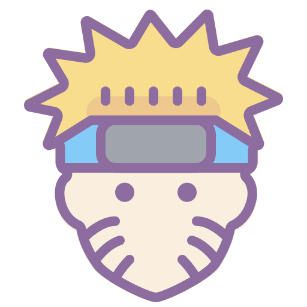

<p align="center">
<a href="https://meoki.vn">
    
</a>
</p>

<h2> Greetings!   </h2>

Hello there! I'm **Meoki**, a passionate individual with a curiosity-driven mindset. I find joy in exploring the wonders of the world and engaging in meaningful conversations with people from diverse backgrounds.

For an overview about me and my some projects, I have [**my portfolio**](https://meoki.vn) and [**my blog**](https://meoki.vn/blog), aiming to inspire and connect with fellow enthusiasts. For some other things, I have social platform profiles below, join me on this journey of creativity and discovery!

Thanks ❤
### Languages
<p>
    
    
    
    
    
    
    
    
    
</p>

### Tools & Frameworks
<p>
    
    
    
    
    
    
    
    
</p>


### Find me around the web 🌎
<a href="https://facebook.com/slytherinnn/"> </a>
- Information in public on <a href="https://meoki.vn/">__Portfolio__</a> ✍🏾
- Sharing updates on <a href="https://facebook.com/slytherinnn/">__Facebook__</a> 💼
- Other products on <a href="https://www.behance.net/meokisama">__Behance__</a> 🏓
- Daily photos on <a href="https://www.instagram.com/hi.im.meoki/">__Instagram__</a> 📷
- "Wibu" collection on <a href="https://www.flickr.com/photos/meokisama/albums">__Flickr__</a> 👾

<br>

##

### And a little Japanese culture
*Hiii, about this 2D industry, we have a static anime-manga-lightnovel blog - [**A Lonely Comet**](https://alonelycomet.meoki.vn/), empire of dreamers, we write everything about anime-manga-light novel.*

<p>
    <a href="https://alonelycomet.meoki.vn/"> </a>
    <a href="https://discord.gg/hNpaMKMtN8"> </a>
</p>
<p>
    
    
</p>


<!--[](https://anilist.co/user/meokisama/)-->

##
___NOTE:___ _Top languages shown below does not indicate my skill level or something like that, like its title - "Most Used Languages", it's just a github metric of which languages I have the most code on Github._

<p align="center">
    <a href="https://github.com/meokisama">
        
    </a>
    <a href="https://github.com/meokisama">
        
    </a>
</p>
    
<!--<div style="overflow: hidden;justify-content:space-around;">
  
  
</div> -->

<div align="center" style="overflow: hidden;justify-content:space-around;">
  
  
</div>

##

<!--START_SECTION:waka-->
**I'm a Night 🦉** 

```text
🌞 Morning                1885 commits        ████░░░░░░░░░░░░░░░░░░░░░   15.72 % 
🌆 Daytime                3940 commits        ████████░░░░░░░░░░░░░░░░░   32.86 % 
🌃 Evening                1500 commits        ███░░░░░░░░░░░░░░░░░░░░░░   12.51 % 
🌙 Night                  4666 commits        ██████████░░░░░░░░░░░░░░░   38.91 % 
```
📅 **I'm Most Productive on Monday** 

```text
Monday                   3278 commits        ███████░░░░░░░░░░░░░░░░░░   27.34 % 
Tuesday                  2988 commits        ██████░░░░░░░░░░░░░░░░░░░   24.92 % 
Wednesday                2777 commits        ██████░░░░░░░░░░░░░░░░░░░   23.16 % 
Thursday                 189 commits         ░░░░░░░░░░░░░░░░░░░░░░░░░   01.58 % 
Friday                   247 commits         █░░░░░░░░░░░░░░░░░░░░░░░░   02.06 % 
Saturday                 946 commits         ██░░░░░░░░░░░░░░░░░░░░░░░   07.89 % 
Sunday                   1566 commits        ███░░░░░░░░░░░░░░░░░░░░░░   13.06 % 
```


📊 **This Week I Spent My Time On** 

```text
🕑︎ Time Zone: Asia/Ho_Chi_Minh

💬 Programming Languages: 
HTML                     2 hrs 35 mins       █████████████████████████   100.00 % 

🔥 Editors: 
VS Code                  2 hrs 35 mins       █████████████████████████   100.00 % 

💻 Operating System: 
Windows                  2 hrs 35 mins       █████████████████████████   100.00 % 
```


 Last Updated on 03/12/2023 04:22:34 UTC
<!--END_SECTION:waka-->
### Summary


*That's all, thanks and have a nice day!*

<p align="center">
    
</p
